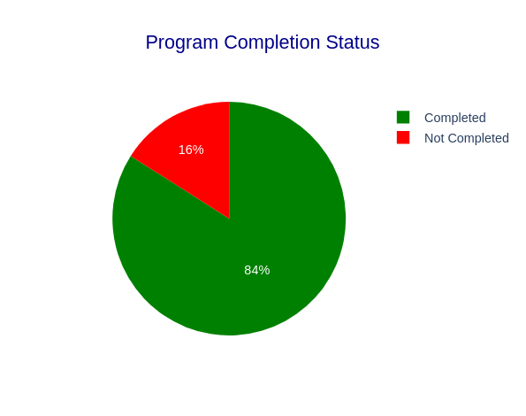

# 🚀 **Tuwaiq Academy Insights**: Streamlit Dashboard for Registration & Program Analysis

## 📌 **Project Overview**
This project explores **Tuwaiq Academy's student registration and program participation data** through a **Streamlit-powered dashboard**. By leveraging **pandas** for data handling and **plotly** for interactive visualizations, we uncover actionable insights into program completion trends, attendance patterns, and student demographics.

### 🌟 **Key Features**:
- **Interactive Dashboard**: Deployed on Streamlit, accessible via any browser.
- **Visual Insights**: Dynamic charts built with Plotly for real-time exploration.
- **Streamlined Workflow**: Efficient and reusable code for data preprocessing and analysis.

---

## 🗂️ **Project Structure**
```
📂 Data/
   ├── cleaning_data.csv       # Preprocessed dataset
   ├── registration.csv       # Program registration details
   └── train.csv              # Dataset with student participation details
📂 Images/
   └── status.png             # Program completion pie chart
📂 NoteBook/
   ├── cleaning_data.ipynb    # Notebook: Data cleaning
   └── Insights.ipynb         # Notebook: EDA
📂 Scripts/
   └── app.py                 # Streamlit app script
README.md                     # Project documentation (this file)
requirements.txt              # Streamlit, pandas, and plotly dependencies
```

---

## 🛠️ **Tech Stack**
- **Streamlit**: Interactive web app framework.
- **pandas**: Data manipulation and preprocessing.
- **plotly**: Interactive visualizations.

---

## 🚀 **How to Run**
1. **Clone the repository**:
   ```bash
   git clone https://github.com/AI-bootcamp/data-science-project-exploratory-data-analysis-beast-eda.git
   cd data-science-project-exploratory-data-analysis-beast-eda
   ```

2. **Install dependencies**:
   ```bash
   pip install -r requirements.txt
   ```

3. **Launch the Streamlit app**:
   ```bash
   streamlit run Scripts/app.py
   ```

4. **Interact with the dashboard**:
   - Navigate to the local URL provided in the terminal (e.g., `http://localhost:8501`).

---

## 📊 **Insights at a Glance**
- **Program Completion Status**:
  - A **pie chart** shows that **84% of students completed their programs**, while **16% did not**.
- **Interactive Features**:
  - Filter by **age**, **gender**, or **region** to explore demographic trends.
  - Drill down into program-specific insights, including **technology type** and **skill levels**.



---

## 🔑 **Key Insights**
- **Completion Trends**:
  - Higher completion rates in programs with in-person attendance.
- **Demographic Patterns**:
  - Students from certain regions show higher completion rates.
- **Employment Impact**:
  - Current employment status correlates with program completion.


---

## 👥 **Team Members**
- **Mana Saleh**  
- **Sarah Alenazi**
- **Tariq Alshammari**
- **Najla Alhomaid** 

---

## 🌟 **Next Steps**
- **Enhance the Dashboard**:
  - Add additional visualizations and insights for deeper analysis.

---

## 🔗 **Useful Links**
- **Streamlit App**: [Open Dashboard](https://data-science-projec-3vnukn5k3snbvwsysjkkbi.streamlit.app/)
- **Presentation**: [View on Prezi](https://prezi.com/view/Ir0sDwMdKsvc6m1R6nJr/)

--- 
